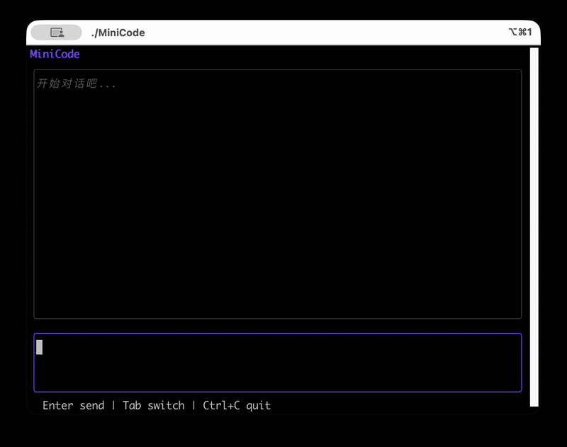

<p align="center">
  
</p>

<p align="center">
  <strong>30 天从零打造你自己的 Claude Code (Day 4/30)</strong>
</p>

<p align="center">
  <sub>如果这个项目对你有帮助，请给一个 ⭐️</sub>
</p>

<p align="center">
  <a href="https://golang.org"></a>
  <a href="LICENSE"></a>
  <a href="https://github.com/JiayuXu0/MiniCode/stargazers"></a>
  <a href="docs/"></a>
</p>


---

## Demo

<p align="center">
  
</p>

**核心特性：**

- **流式输出** - 打字机效果，实时显示 AI 思考过程
- **工具调用** - Glob/Grep/View/Bash/Write/Edit 六大工具
- **多轮对话** - 完整的上下文记忆
- **取消支持** - Esc 随时中断，不浪费 Token

---

## 为什么做这个项目

> **"Talk is cheap, show me the code."** — Linus Torvalds

市面上有很多讲 AI Agent 的文章，但大多停留在概念层面。这个项目不同：

| 其他教程 | MiniCode |
|---------|----------|
| 讲概念、画架构图 | **3600+ 行教程 + 完整可运行代码** |
| 用 Python/LangChain | **Go 语言 + Fantasy SDK** |
| Hello World 级别 | **真正可用的 AI 编程助手** |
| 一篇文章讲完 | **30 天渐进式学习** |

### 你将学到什么

```
Day 1-4:   基础篇 ─────────────────────────────────────
           ├── AI Agent 核心概念
           ├── 工具系统设计与实现
           ├── TUI 交互界面 (Bubble Tea)
           └── 流式输出 + 取消机制

Day 5-10:  工具篇 ─────────────────────────────────────
           ├── 文件读写 (Read/Write)
           ├── 代码编辑 (Edit with diff)
           ├── 命令执行 (Bash)
           └── 内容搜索 (Grep)

Day 11-20: 进阶篇 ─────────────────────────────────────
           ├── Agent 循环与决策
           ├── 上下文管理与压缩
           ├── 错误恢复机制
           └── 并行工具调用

Day 21-30: 高级篇 ─────────────────────────────────────
           ├── 子 Agent 调度
           ├── 记忆系统
           ├── 性能优化
           └── 生产级部署
```

---

## 快速开始

### 1. 克隆项目

```bash
git clone https://github.com/JiayuXu0/MiniCode.git
cd MiniCode
```

### 2. 获取 API Key

前往 [智谱 AI](https://bigmodel.cn/) 注册并获取 API Key（有免费额度）

```bash
# 创建 .env 文件
echo "OPENAI_API_KEY=你的API_KEY" > .env
```

### 3. 运行

```bash
go run .
```

**操作说明：**
- `Enter` - 发送消息
- `Tab` - 切换焦点（输入框 / 消息区）
- `Esc` - 取消当前请求 / 退出
- `↑↓` - 滚动查看历史消息

---

## 教程目录

| Day | 主题 | 内容 | 状态 |
|-----|------|------|:----:|
| **Day 1** | [创建第一个 AI Agent](docs/01.md) | Fantasy SDK、Provider、Agent 基础 | ✅ |
| **Day 2** | [给 Agent 添加工具](docs/02.md) | Tool 系统、Glob 文件搜索、AgentResult | ✅ |
| **Day 3** | [构建交互式 TUI](docs/03.md) | Bubble Tea、Elm 架构、多轮对话 | ✅ |
| **Day 4** | [实现流式输出](docs/04.md) | Streaming API、跨 goroutine 通信、取消机制 | ✅ |
| Day 5 | 文件读写工具 | View/Write 实现、安全检查 | 📋 |
| Day 6 | 代码编辑工具 | Edit with diff、冲突处理 | 📋 |
| Day 7 | Bash 命令执行 | 安全沙箱、超时控制 | 📋 |
| Day 8-10 | Grep 与高级搜索 | 正则匹配、上下文显示 | 📋 |
| Day 11-20 | Agent 循环 | 决策引擎、上下文管理 | 📋 |
| Day 21-30 | 高级特性 | 子 Agent、记忆、部署 | 📋 |

> 每篇教程 300-1400 行，包含**完整代码**、**架构图**、**原理讲解**和**常见问题**

---

## 技术架构

```
┌─────────────────────────────────────────────────────────────────┐
│                         MiniCode                                 │
├─────────────────────────────────────────────────────────────────┤
│                                                                 │
│   main.go                        tui/                           │
│   ┌──────────────┐               ┌──────────────────────────┐   │
│   │ Provider     │               │ model.go   - 状态管理     │   │
│   │ (智谱 GLM)   │               │ update.go  - 事件处理     │   │
│   │      ↓       │               │ view.go    - 界面渲染     │   │
│   │ Agent        │◄─────────────▶│ stream.go  - 流式处理     │   │
│   │ (Fantasy)    │               │ style.go   - 样式定义     │   │
│   └──────────────┘               └──────────────────────────┘   │
│          │                                                      │
│          ▼                                                      │
│   tools/                                                        │
│   ┌──────────────────────────────────────────────────────────┐  │
│   │ glob.go   - 文件搜索     │ bash.go  - 命令执行          │  │
│   │ view.go   - 文件查看     │ write.go - 文件写入          │  │
│   │ grep.go   - 内容搜索     │ edit.go  - 代码编辑          │  │
│   └──────────────────────────────────────────────────────────┘  │
│                                                                 │
└─────────────────────────────────────────────────────────────────┘
```

### 技术栈

| 组件 | 技术 | 说明 |
|------|------|------|
| 语言 | Go 1.21+ | 高性能、强类型、并发原生支持 |
| AI SDK | [Fantasy](https://charm.land/fantasy) | Charmbracelet 出品，统一多 Provider |
| TUI | [Bubble Tea](https://github.com/charmbracelet/bubbletea) | Elm 架构的终端 UI 框架 |
| 样式 | [Lipgloss](https://github.com/charmbracelet/lipgloss) | 终端样式库 |
| LLM | 智谱 GLM-4 | 国产大模型，OpenAI 兼容接口 |

### 为什么选择 Go + Fantasy？

- **性能**: 编译成单一二进制，启动快、内存占用低
- **并发**: goroutine 天然适合流式处理
- **跨平台**: 一次编译，Windows/Mac/Linux 都能跑
- **Fantasy**: 比 LangChain 更轻量，类型安全，无运行时依赖

---

## 项目结构

```
MiniCode/
├── main.go                 # 程序入口
├── tui/                    # TUI 界面
│   ├── model.go            # Model 定义
│   ├── update.go           # Update 逻辑
│   ├── view.go             # View 渲染
│   ├── stream.go           # 流式处理
│   ├── message.go          # 消息类型
│   ├── style.go            # 样式定义
│   └── util.go             # 工具函数
├── tools/                  # 工具集
│   ├── glob.go             # 文件搜索
│   ├── view.go             # 文件查看
│   ├── grep.go             # 内容搜索
│   ├── bash.go             # 命令执行
│   ├── write.go            # 文件写入
│   └── edit.go             # 代码编辑
├── docs/                   # 教程文档
│   ├── 01.md               # Day 1: 创建 Agent
│   ├── 02.md               # Day 2: 添加工具
│   ├── 03.md               # Day 3: TUI 界面
│   └── 04.md               # Day 4: 流式输出
└── .vscode/                # VSCode 调试配置
```

---

## 常见问题

<details>
<summary><b>Q: 支持哪些 LLM？</b></summary>

通过 Fantasy 的 `openaicompat` Provider，支持所有 OpenAI 兼容接口：
- 智谱 GLM（默认）
- 阿里通义千问
- 百度文心一言
- DeepSeek
- 本地模型（Ollama、vLLM 等）

修改 `main.go` 中的 `baseURL` 和 `modelID` 即可切换。
</details>

<details>
<summary><b>Q: 为什么不用 Python？</b></summary>

1. **性能**: Go 编译后是原生二进制，启动快、内存小
2. **部署**: 无需安装运行时，复制一个文件就能跑
3. **并发**: goroutine 处理流式输出比 async/await 更自然
4. **类型安全**: 编译时发现错误，不用等运行时踩坑
</details>

<details>
<summary><b>Q: 和 Claude Code 差距在哪？</b></summary>

MiniCode 是教学项目，目标是让你理解原理。和 Claude Code 的差距：
- 模型能力（Claude 4 vs GLM-4）
- 工具数量（6 个 vs 20+）
- 上下文管理（简单 vs 复杂压缩算法）
- 错误恢复（基础 vs 生产级）

但核心架构是一致的，学完你可以自己扩展。
</details>

<details>
<summary><b>Q: 教程更新频率？</b></summary>

目前已完成 Day 1-4，后续内容持续更新中。欢迎 Watch 项目获取更新通知。
</details>

---

## 贡献

欢迎参与贡献！

- **Star** - 如果觉得有帮助，点个 Star 支持一下
- **Issue** - 发现 Bug 或有建议，欢迎提 Issue
- **PR** - 修复问题或添加功能，欢迎提 PR
- **分享** - 觉得教程有价值，分享给更多人

---

## 学习资源

- [Fantasy SDK 文档](https://charm.land/fantasy)
- [Bubble Tea 教程](https://github.com/charmbracelet/bubbletea)
- [智谱 AI 开放平台](https://bigmodel.cn/)
- [Go 语言圣经](https://gopl.io/)

---

## License

MIT License - 随便用，注明出处就行

---

<p align="center">
  <sub>Made with ❤️ by <a href="https://github.com/JiayuXu0">JiayuXu0</a></sub>
</p>

